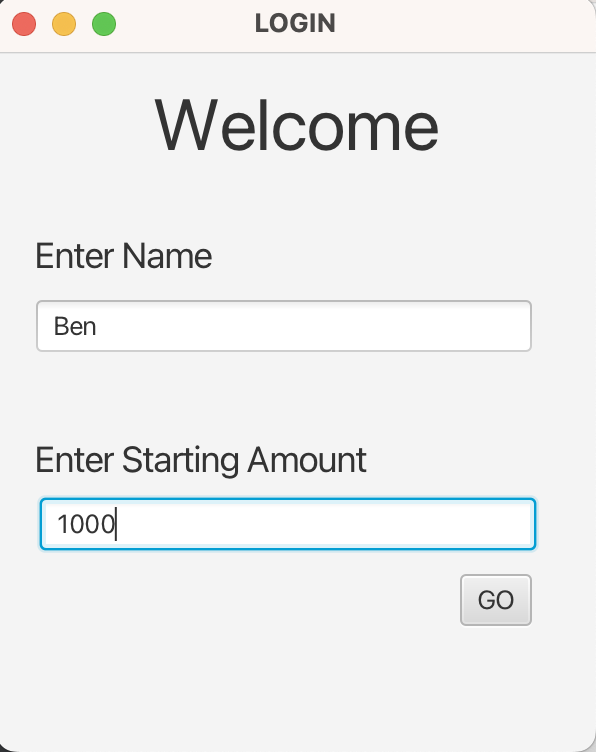
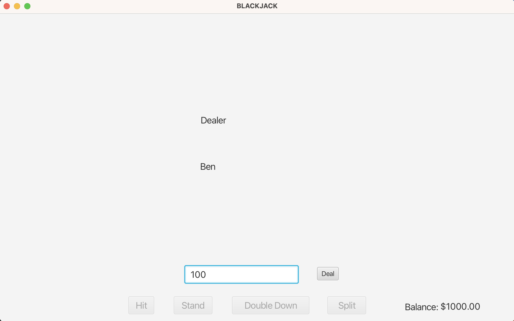
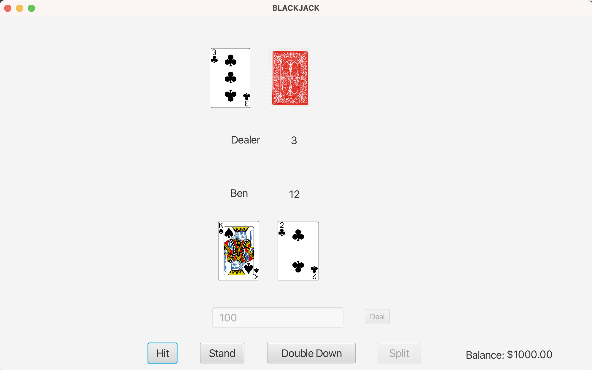
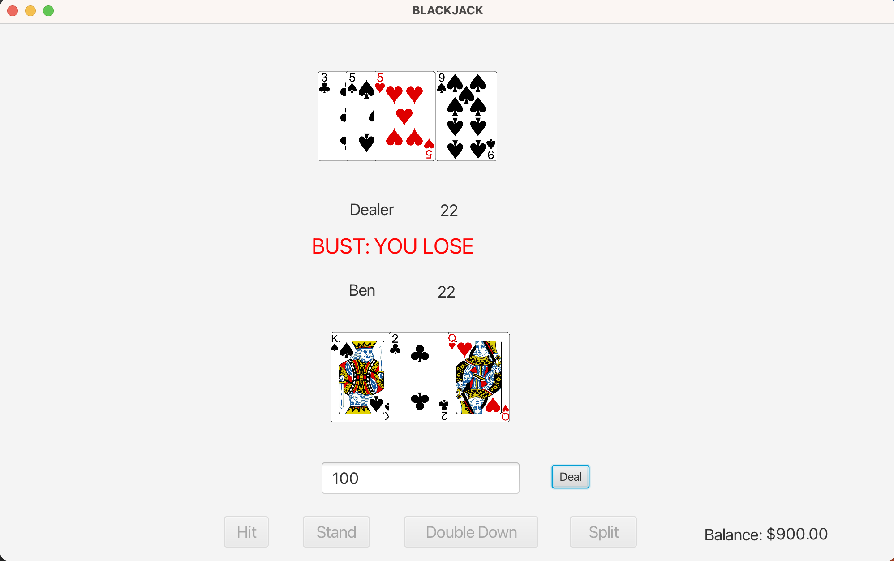

# Blackjack

## Setup

### 1: Clone this github repo

### 2: Open in IDE

### 3: Run BlackjackApplication.java file

 

## How to Play

### 1: Enter your name

### 2: Enter the amount of money you would like to start with

### 3: Press Go

### 4: Enter the amount you would like to bet and press deal

### 5: Press hit or stand based on your cards to play out the hand

### 6: Once the round is over enter a new bet and play again

